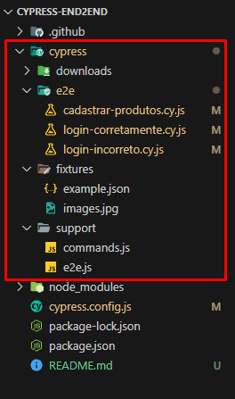
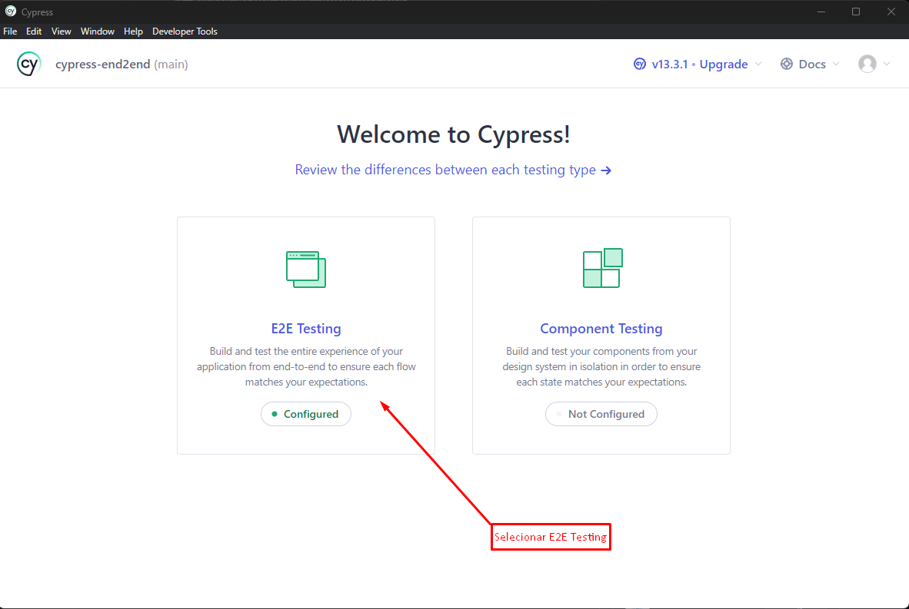
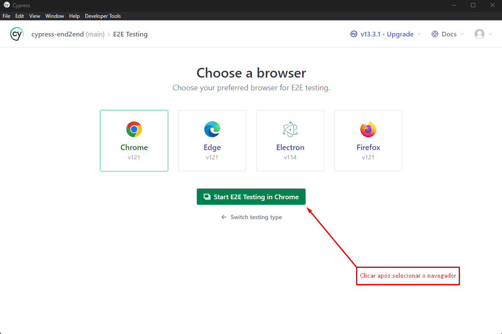
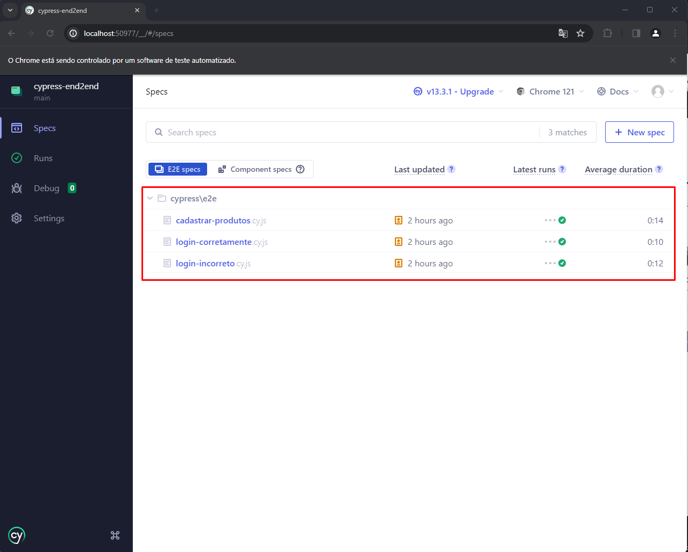
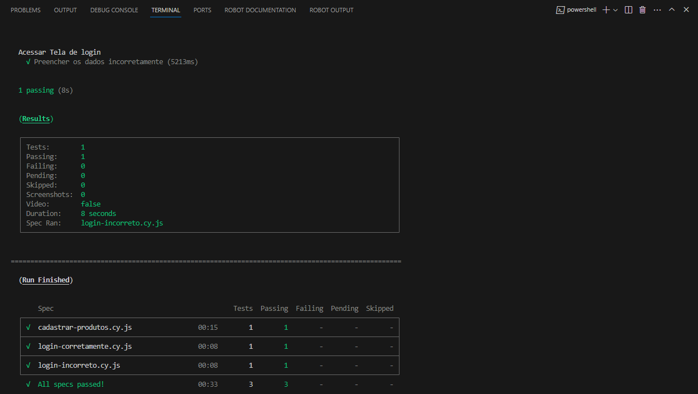

# Cypress end2end

## Tecnologias
* [Cypress](https://docs.cypress.io/guides/getting-started/installing-cypress)
* [Node.js](https://nodejs.org/en)

## Arquitetura do Projeto



1° Imagem: Arquitetura dos Testes Automatizados.

## PASSO A PASSO PARA EXECUTAR AUTOMAÇÃO

### 1° - É necessário ter as seguintes tecnologias instalados:

* [Cypress](https://docs.cypress.io/guides/getting-started/installing-cypress)
* [Node.js](https://nodejs.org/en)
* [Visual Studio Code](https://code.visualstudio.com/)

### 2° - Clonar o repositório do GitHub:

Para ter acesso ao repositório:
```bash
https://github.com/lucassillva/cypress-end2end.git
```

### 3° Abrir o projeto no Visual Studio Code:

Para o desenvolvimento do teste automatizado foi utilizado o Visual Studio Code, no entanto, é recomendado ter a ferramenta instalada na máquina. Caso tenha instalado corretamente, abra o projeto clonado do GitHub.

### 4° Execução dos testes automatizados

#### 4.1 Primeira Maneira de Executar Testes Automatizados
Para executar o projeto, é necessário digitar um dos seguintes comandos:

```shell
npx Cypress open
```

2° Imagem: Tela apresentada após digitar o comando.


3° Imagem: Tela de seleção de browser, para efetuar E2E testing.


4° Imagem: Apresentação dos testes e2e e seus devidos status.

#### 4.2 Segunda Maneira de Executar Testes Automatizados
Outra forma de executar a automação é:

```shell
npx Cypress run
```
Após executado o comando, será realizado todos os testes e ao final será apresentado o status de cada um dos testes executados.

5° Imagem: Tela apresentando os resultados da automação